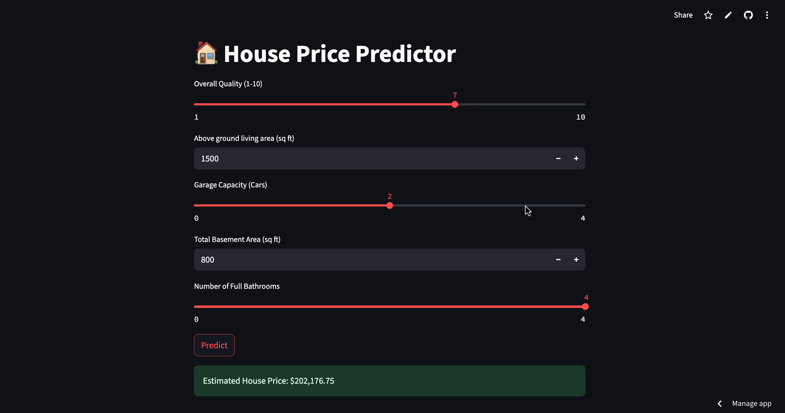

# 🏡 House Price Prediction App

A web application built using Streamlit to predict the **selling price of a house** based on features like area, number of bathrooms, garage capacity, and overall quality. The model is trained on the [Kaggle House Prices Dataset](https://www.kaggle.com/c/house-prices-advanced-regression-techniques).

---

## 🚀 Live Demo
🧪 This app can be deployed locally or on [Streamlit Cloud](https://share.streamlit.io).

---

## 📌 Features

- 📊 Input fields for:
  - Overall Quality
  - Living Area (sq ft)
  - Garage Capacity
  - Basement Area (sq ft)
  - Number of Bathrooms
- 🤖 Trained with `LinearRegression`
- 📈 Real-time price prediction
- 💻 Deployable with one click using Streamlit

---

## 📁 Project Structure

```
house-price-predictor/
│
├── app.py               # Streamlit web app
├── train_model.py       # Script to train & export model.pkl
├── model.pkl            # Trained ML model (generated)
├── requirements.txt     # Required Python libraries
└── README.md            # Project overview and instructions
```

---

## 🧠 How It Works

The model uses the following features to predict house prices:

- `OverallQual` – Overall material and finish quality
- `GrLivArea` – Above-ground living area (sq ft)
- `GarageCars` – Capacity of garage (cars)
- `TotalBsmtSF` – Basement area (sq ft)
- `FullBath` – Number of full bathrooms

Trained using `LinearRegression` from scikit-learn.

---

## 🛠️ Setup Instructions

1. **Clone the repository**
```bash
git clone https://github.com/your-username/house-price-predictor.git
cd house-price-predictor
```

2. **Install dependencies**
```bash
pip install -r requirements.txt
```

3. **Add the dataset**
Download `train.csv` from Kaggle and place it in the project folder.

4. **Train the model**
```bash
python train_model.py
```

5. **Run the Streamlit app**
```bash
streamlit run app.py
```

---

## 📷 Screenshot

> Add a screenshot of your Streamlit app here:
> ```
> 
> ```

---

## ✨ Future Improvements

- Add more input features (location, year built, etc.)
- Use advanced models like `XGBoost` or `RandomForest`
- Include feature importance or prediction confidence
- Add data visualizations

---

## 📜 License

MIT License – use freely and modify as needed.

---

## 🤝 Acknowledgements

- [Kaggle: House Prices - Advanced Regression Techniques](https://www.kaggle.com/c/house-prices-advanced-regression-techniques)
- Streamlit.io for UI framework
